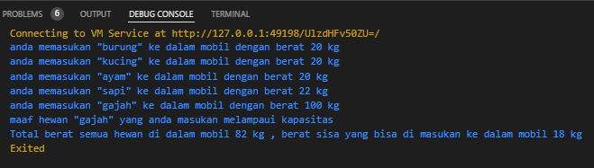

# Praktikum Materi KMFlutter – Dart Object Oriented Programming 1

Code membuat class Hewan
```dart
class Hewan {
  int berat = 0 ;
  String namaHewan = '';
   Hewan(this.namaHewan,this.berat)
  {
    print('anda memasukan \"$namaHewan\" ke dalam mobil dengan berat $berat kg');
  }
}
```

Code membuat class Mobil
```dart
import 'Hewan.dart';

class Mobil {
  int kapasitas = 100;
  List<Hewan> muatan = [];

  void tambahMuatan(Hewan hewan){
    if (kapasitas > hewan.berat) {
      muatan.add(hewan);
    }else{
      print('maaf hewan \"${hewan.namaHewan}\" yang anda masukan melampaui kapasitas');
    }
  }

  void totalMuatan(){
    int totalBerat = 0;
    for (Hewan hewan in muatan) {
      totalBerat += hewan.berat;
    }
    if(totalBerat <= kapasitas){
      int sisaBerat = kapasitas - totalBerat ;
    print('Total berat semua hewan di dalam mobil $totalBerat kg , berat sisa yang bisa di masukan ke dalam mobil $sisaBerat kg');
    }else{
      print('maaf total berat di dalam mobil $totalBerat kg melampaui kapasitas mobil sebesar $kapasitas kg');
    }
  }
}

```

Code pada fungsi main
```dart
import 'Hewan.dart';
import 'Mobil.dart';


void main() {
  Hewan burung = Hewan('burung',20);
  Hewan kucing= Hewan('kucing',20);
  Hewan ayam = Hewan('ayam',20);
  Hewan sapi = Hewan('sapi',22);
  Hewan gajah = Hewan('gajah',100);

  Mobil mobil = Mobil();
  mobil.tambahMuatan(burung);
  mobil.tambahMuatan(kucing);
  mobil.tambahMuatan(ayam);
  mobil.tambahMuatan(sapi);
  mobil.tambahMuatan(gajah);
  mobil.totalMuatan();

}
```

Hasil Output di bawah ini ada salah satu hewan yang tidak di masukan kedalam muatan karna melebihi kapasitas
