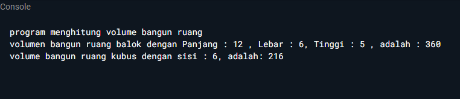

#  Praktikum - Dart Object Oriented Programming 2


## Task1

Code membuat class bangun ruang
```dart
class BangunRuang{
  late double panjang;
  late double lebar;
  late double tinggi;

  void volume(){
    print('program menghitung volume bangun ruang');
  }

}
```

Code membuat class kubus yang inheritance terhadap class bangun ruang
```dart
class Kubus extends BangunRuang{
    double sisi = 6;
    late double vKubus;
@override
  void volume() {
    vKubus = sisi * sisi * sisi;
    print('volume bangun ruang kubus dengan sisi : $sisi, adalah: $vKubus');
  }  
}
```

Code membuat class Balok yang inheritance terhadap class bangun ruang
```dart
class Balok extends BangunRuang{  
  double panjang = 12;
  double lebar = 6;
  double tinggi = 5;
  late double vBalok;
@override
  void volume() {
    vBalok = panjang * lebar * tinggi;
    print('volumen bangun ruang balok dengan Panjang : $panjang , Lebar : $lebar, Tinggi : $tinggi , adalah : $vBalok');
  }

}
```


Code fungsi main
```dart
void main(){
   BangunRuang bangun = BangunRuang()..volume();
   BangunRuang balok = Balok()..volume();
   BangunRuang kubus = Kubus()..volume();
}
```

Hasil output yang di hasilkan



---

## Task2

Code membuat class Matematika
```dart
class Matematika{
  
  hasil(x,y){}
}
```

Code membuat class KelipatanPersekutuanTerkecil yang melakukan interface terhadap class Matematika
```dart
class KelipatanPersekutuanTerkecil implements Matematika{
  
  @override
  hasil(x,y) {
    int i = x > y ? x : y;
    while(true){
      if(i % x == 0 && i % y == 0){
        return i;
      }
      i++;
    }
 }
}
```

Code membuat class FaktorPersekutuanTerbesar yang melakukan interface terhadap class Matematika
```dart
class FaktorPersekutuanTerbesar implements Matematika{

  @override
   hasil(x, y) {
    if (y == 0) {
      return x;
    } else {
      return hasil(y, x % y);
    }
  }
}
```

Code membuat fungsi main
```dart
void main(){
  Matematika kpk = KelipatanPersekutuanTerkecil();
  print(kpk.hasil(18, 20));
  Matematika fpb= FaktorPersekutuanTerbesar();
  print(fpb.hasil(18, 12));
}
```

Hasil output 

