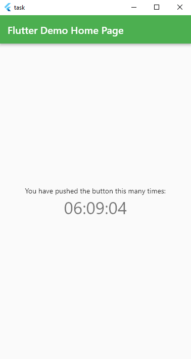

# Praktikum - Introduction Flutter Widget

Memberikan depedency untuk library "intl" pada file pubspec.yaml

```dart
dependencies:
  flutter:
    sdk: flutter
  cupertino_icons: ^1.0.2
  intl: ^0.17.0
```


Code pada main.dart pada file lib
 
```dart 
import 'dart:async';
import 'package:intl/intl.dart';
import 'package:flutter/material.dart';

void main() {
  runApp(const MyApp());
}

class MyApp extends StatelessWidget {
  const MyApp({super.key});

  @override
  Widget build(BuildContext context) {
    return MaterialApp(
      debugShowCheckedModeBanner: false,
      title: 'Flutter Demo',
      theme: ThemeData(
        primarySwatch: Colors.green,
      ),
      home: const MyHomePage(title: 'Flutter Demo Home Page'),
    );
  }
}

class MyHomePage extends StatefulWidget {
  const MyHomePage({super.key, required this.title});
  final String title;

  @override
  State<MyHomePage> createState() => _MyHomePageState();
}

class _MyHomePageState extends State<MyHomePage> {
  String clock = 'Clock';
  late Timer timer;

  void initState() {
    timer = Timer.periodic(const Duration(seconds: 1), (timer) {
      setState(() {
        clock = DateFormat('HH:mm:ss').format(DateTime.now());
      });
     });
     super.initState();
  }

  @override
  Widget build(BuildContext context) {
    return Scaffold(
      appBar: AppBar(
        title: Text(widget.title),
      ),
      body: Center(
        child: Column(
          mainAxisAlignment: MainAxisAlignment.center,
          children: <Widget>[
            const Text(
              'You have pushed the button this many times:',
            ),
            Text(
              clock,
              style: Theme.of(context).textTheme.headline4,
            ),
          ],
        ),
      ),
    );
  }
}

```


Hasil output setelah di run

