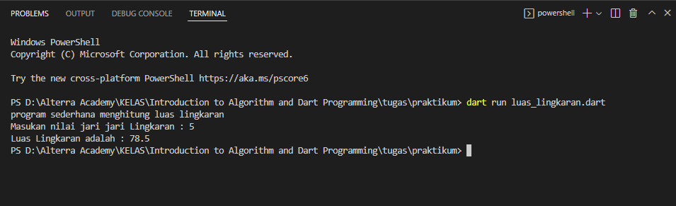
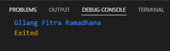

# Membuat Rumus Luas Lingkaran

Membuat program sederhana menghitung luas lingkaran pada dart

```dart
void main() {
  print('program sederhana menghitung luas lingkaran');
  const phi = 3.14;
  var jari;
  stdout.write ('Masukan nilai jari jari Lingkaran : ');
  jari = stdin.readLineSync(); 
  double hasilJari = double.parse(jari);
  double Luas = phi * hasilJari * hasilJari;
  print('Luas Lingkaran adalah : $Luas'); 
}
```
hasil Output dengan terminal



# Mengabungkan 3 variabel String

```dart
void main(){
  var firstName = 'Gilang';
  var middleName = 'Fitra';
  var lastName = 'Ramadhana';
  var fullName = "$firstName $middleName $lastName";
  print(fullName);
}
```

Output yang di hasilkan

