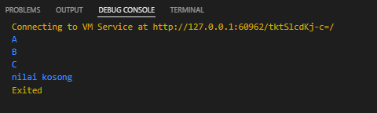
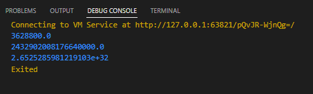

# Praktikum – Branching, Looping, Function

## Soal 1
Code

```dart
String nilai(int nilai){
  if(nilai > 70){
    return 'A';
  }else if(nilai > 40){
    return 'B';
  }else if(nilai > 0){
    return 'C';
  }else{
    return 'nilai kosong';
  }
}

void main(){
  var gilang = nilai(80);
  var fitra = nilai(50);
  var ramadhana = nilai(20);
  var gilangFitraRamadhana = nilai(0);

  print(gilang);
  print(fitra);
  print(ramadhana);
  print(gilangFitraRamadhana);

}
```

Hasil output 



## Soal2

Code

```dart
double factorial(double value){
  if(value == 1){
    return 1;
  }else{
    return value * factorial(value - 1);
  }
}

void main(){
  print(factorial(10));
  print(factorial(20));
  print(factorial(30));
}
```

Hasil Output


