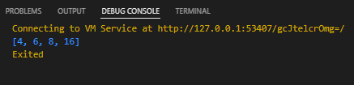
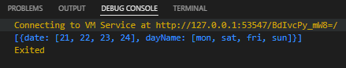

# Tugas Praktikum Materi KMFlutter – Advance Function – Async-Await

Soal

1. Buatlah sebuah fugsi dari spesifikasi berikut :
    - a. menerima 2 parameter, yaitu list data dan pengali.
    - b. lakukan perulangan pada list data secara asynchronous.
    - c. tiap perulangan, kalikan element list data dengan pengali.
    - d. return list baru yang berisi hasil proses di atas.


Code Program dari soal nomer 1
    
```dart
Future<List<int>> soal1(List<int> data, int pengali ) {
return Future.delayed(Duration(seconds: 1),(){
List<int> list = [] ;
for(int sum = 0; sum < data.length; sum++){
list.add(data[sum] * pengali);
}
return list;
});
}

void main() async {
List<int> soal = await soal1([2,3,4,8], 2);
print(soal);

```

Hasil dari code program di atas



---

2. buatlah sebuah list dengan spesifikasi sebagai berikut :
- a. tiap element-nya berupa list juga
- b. tiap element wajib terdapat 2 data (sub-element)
Buatlah sebuah Map dengan menggunakan list tersebut!

Code Program dari Soal di atas

```dart
void main() {
  List<int> date = [21,22,23,24];
  List<String> dayName = ['mon','sat','fri','sun'];
  Map day = {
    'date' : date,
    'dayName' : dayName,
  };

  List list = [day];

  print(list);
  
}
```

Hasil dari Code Program di atas

